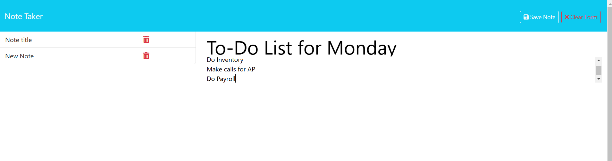

# Express.js Note Taker

## Table of Contents

- [Description](#description)
- [Installation](#installation)
- [Usage](#usage)
- [Credits](#credits)
- [Images](#images)
- [LINKS](#LINKS)

## Description
This application is designed to allow the user (e.g. business owner) to create and save notes to help organize and keep track of tasks that need to be completed. We use Express.js for back-end logic, and local storage to store persistent note data from a JSON file.  

## Installation 
Follow the Live URL (below). This application will deploy on Render. 

## Usage
Initally, you will be presented with the [landing page](public/assets/images/note-taker-landing.png), you can access the note taker by clicking the link to the [notes page](public/assets/images/note-html.png) where you can view a list of existing notes on the left-hand column or create a new note in the right-hand column. To create a new note, you will enter a title and text into the note fields. As you do so, a "Save Note" button as well as a "Clear Form" button will appear in the navigation at the top of the page. Once you save your note, you will see it populate on the existing list located in the left-hand column. If you click on a saved note from the left column, it will appear in the right column and a "New Note" button will appear in the navigation. 

## Credits
Starter code given by Instructor. Additional references for node.js and express can be found on [MDN Web Docs: Server-side | Express and Node.js](https://developer.mozilla.org/en-US/docs/Learn/Server-side/Express_Nodejs/Introduction), and for local storage, [MDN Web Docs: Window: localStorage Property](https://developer.mozilla.org/en-US/docs/Web/API/Window/localStorage)

## Author
Stacy Herbert

## Images

# __________________________________________________________________________________

# LINKS

## GitHub Repository: 
https://github.com/JLH-Owner/express.js-note-taker

## Live URL 
https://express-js-note-taker-ija4.onrender.com

